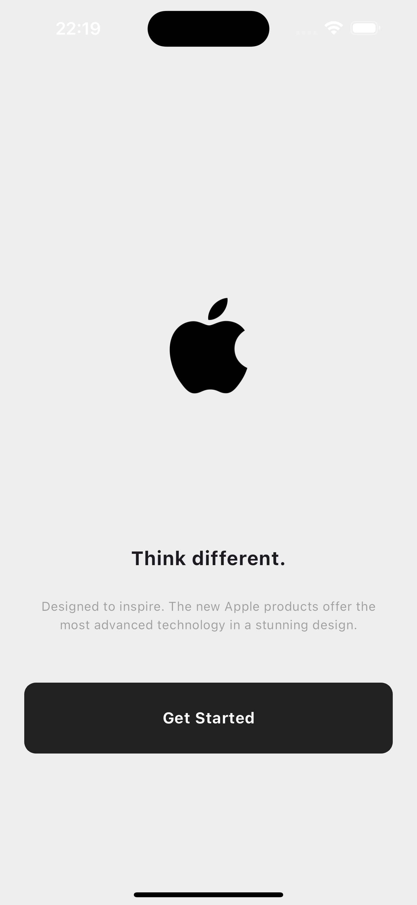
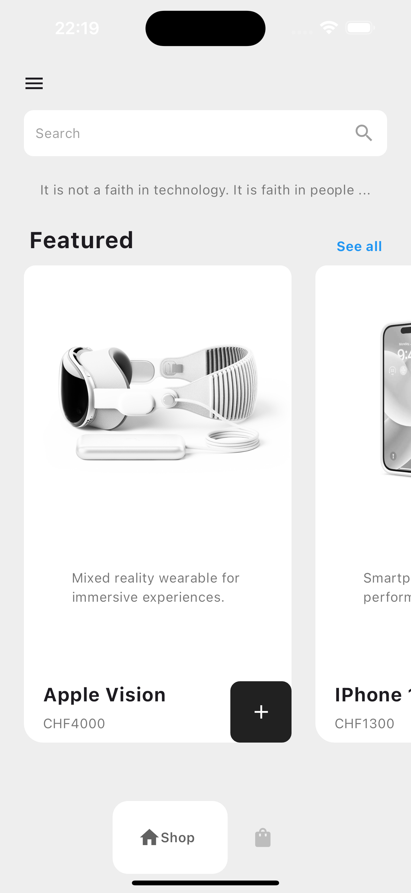
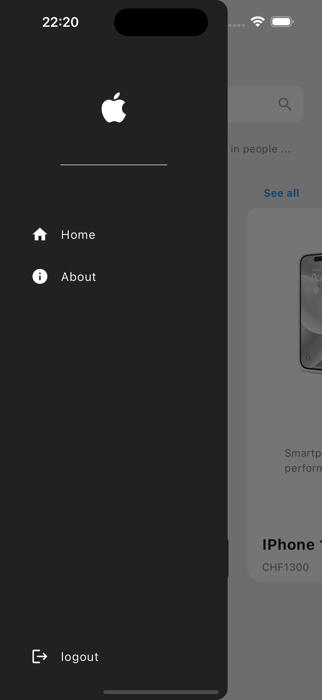
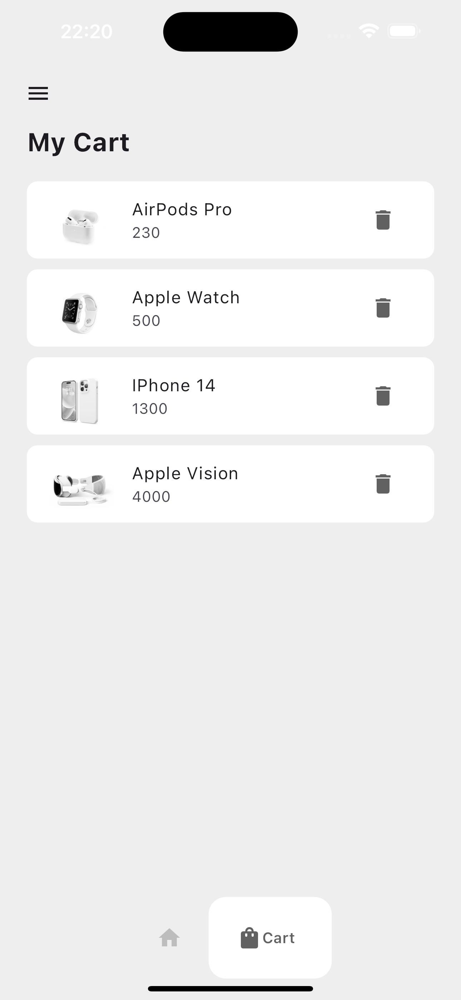

# Apple Shop App

            

This Flutter application offers an elegant and minimalist shopping experience for Apple products. The app showcases a selection of four premium products within a modern and aesthetically pleasing design, featuring a white, black, and light gray color scheme.

---------------------------------------------------------------------------------------------------------------------------

Features:

1. IntroPage
The app welcomes users with a sleek intro page, providing a brief introduction to the Apple Shop experience. The minimalist design ensures a clean and focused presentation.

2. HomePage
The homepage showcases the four available products: Apple Vision, AirPods, iPhone 14, and Apple Watch. Each product is highlighted with high-quality images and precise descriptions, enabling users to make informed purchasing decisions.

3. Drawer
The integrated navigation drawer offers easy access to various app functions and pages. Users can effortlessly navigate between different sections of the app, including product pages and the shopping cart.

4. CartPage
The cart page allows users to review their selected products, adjust quantities, and complete the checkout process. The checkout is designed to be intuitive, ensuring a seamless user experience.

---------------------------------------------------------------------------------------------------------------------------

Design:

The application is characterized by a clean, modern design in shades of white, black, and light gray. This color scheme gives the app an elegant and professional appearance, reflecting the exclusivity of Apple products.

---------------------------------------------------------------------------------------------------------------------------

Technologies:

  - Framework: Flutter
  - Language: Dart

---------------------------------------------------------------------------------------------------------------------------

Demo/ Preview of the Website

https://github.com/user-attachments/assets/e5f68be2-d09e-4581-889d-9b59201faf32

---------------------------------------------------------------------------------------------------------------------------

Installation & Usage

1. Clone this repository:

-      git clone https://github.com/username/apple_shop_flutter.git

2. Navigate to the project directory:

-     cd apple_shop_flutter

3. Install the dependencies:

-     flutter pub get

4. Run the application:

-     flutter run

---------------------------------------------------------------------------------------------------------------------------

Contributions:

Contributions are welcome! Please open an issue to report bugs or suggest new features. Pull requests are also appreciated.

---------------------------------------------------------------------------------------------------------------------------

License:

This project is licensed under the MIT License. See the LICENSE file for details.

  
